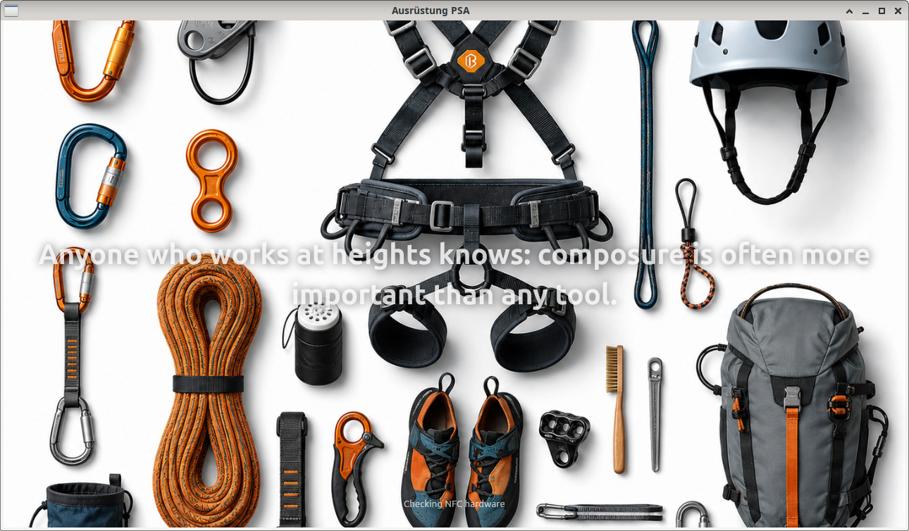

# Ausruestung



Flutter-Anwendung zur Verwaltung von Kletterausrüstung und PSA-Prüfungen.
Zielplattformen sind Linux und Android; entwickelt wird unter Linux mit
IntelliJ.

Diese Datei richtet sich an Entwickler. Die Bedienung beschreibt `HOWTO.md`.

## Aufbau

Fachlogik liegt in `lib/services/`, die Oberfläche in `lib/`. Die Tabs kennen
einander nicht: gemeinsamer Zustand liegt in `app_state.dart` und wird über
Signale weitergereicht. Services kennen keinen `BuildContext` — sie geben
Meldungen zurück, die Oberfläche zeigt sie mit `notify()`.

Die Services werden einmalig in `main.dart` zusammengebaut (ConfigManager,
PlatformInfo, DatabaseManager, NfcService) und als fertiger `AppController`
weitergereicht.

## Datenmodell

Drei Tabellen in SQLite:

| Tabelle | Inhalt |
| --- | --- |
| `artikel` | einzelnes Stück Ausrüstung, fortlaufende `ArtikelID`, eigene Seriennummer |
| `teile` | Bauart (Name, Hersteller, Material, Norm), fortlaufende `TeilNummer` |
| `pruefungen` | Prüftermine, hängen über `ArtikelID` am Artikel |

Ein Artikel verweist über `TeilNummer` auf ein Teil; ein Teil kann zu vielen
Artikeln gehören. Prüfungen gehen bei der Löschung des Artikels per
`ON DELETE CASCADE` mit — dafür muss `PRAGMA foreign_keys = ON` gesetzt sein,
was `db_manager.open()` in `onConfigure` erledigt.

`ArtikelID` und `TeilNummer` werden beim Anlegen vergeben und sind in der
Oberfläche nicht editierbar. Bilder liegen als BLOB in der Datenbank und
werden nach außen als Base64-Text weitergereicht.

Gelöscht wird nicht wirklich: die Spalte `deleted` markiert den Datensatz, das
Bild wird geleert, von den Prüfungen bleibt die letzte. So bleibt die Nummer
vergeben — sonst trüge irgendwann ein anderer Artikel dieselbe Kennung wie ein
alter Ausdruck. Die Oberfläche blendet markierte Datensätze aus; über das Menü
lassen sie sich als CSV ausgeben.

## Multi-Kunden

Jeder Kunde hat einen eigenen Ordner:

```
<Basis>/<Kunde>/ini/config.ini
<Basis>/<Kunde>/sql_db/Ausruestung.db
```

Basis ist auf dem Desktop `~/Ausruestung`, mobil der App-Ordner der Plattform
(`getApplicationSupportDirectory()`). Beim Start wird der zuletzt benutzte
Kunde geöffnet — erkennbar an `last_access` in der jeweiligen `config.ini`.

## Besonderheiten

- Gespeichert wird beim Verlassen eines Feldes, nicht bei jedem Tastendruck,
  und nur bei tatsächlicher Änderung.
- Datumsangaben liegen intern als ISO vor und werden im eingestellten Format
  angezeigt. Das Ablegedatum wird aus Kaufdatum und Nutzungsdauer berechnet —
  außer man gibt es von Hand ein.
- Bilder werden nicht mit der Liste geladen, sondern für den angezeigten
  Datensatz einzeln nachgeholt. Danach räumt `ImageService` auf: zu große
  werden verkleinert, alte PNG in JPEG umgewandelt und nur bei tatsächlicher
  Änderung zurückgeschrieben. So stellt sich der Bestand beim Durchsehen von
  selbst um; durchsichtige Flächen werden dabei weiß.
- NFC läuft auf Android über `nfc_manager`, auf dem Desktop über einen
  PC/SC-Leser. Beide horchen dauerhaft; die Oberfläche merkt keinen
  Unterschied. Ein Scan trägt die Seriennummer ein, wenn der Cursor im leeren
  Seriennummernfeld steht — sonst wird der Artikel dazu gesucht.
- PDF in zwei Formen: ein Blatt je Artikel, oder eine Packliste je Lagerort.
  Bei der Packliste lassen sich gleichnamige Sets unter einer Überschrift
  bündeln — je Teil erscheint dann nur ein Bild.
- Import ersetzt vorhandene Datensätze, Migration überspringt sie.
- Die Oberfläche kennt hell, dunkel und „wie das System"; die Einstellung
  liegt je Kunde in der `config.ini`.
- Teil, Prüfungen, Bilder und die weiteren Artikelfelder lassen sich
  zuklappen. Der Zustand bleibt über den Neustart erhalten.

## Übersetzung

Nach dem Muster von gettext: der deutsche Text bleibt im Quelltext und ist
zugleich der Schlüssel. Jede Datei bringt dafür eine eigene Zeile mit:

```dart
String ttt(String text, [Map<String, Object?> werte = const {}]) =>
    Translate.ttt(text, werte);
```

Darunter steht dieselbe Zeile auskommentiert, die den Text unverändert
zurückgibt. Wer die Übersetzung nicht will, löscht den Import und tauscht die
Kommentarzeichen — die Anwendung läuft weiter, in der Sprache des Quelltextes.

Platzhalter stehen in geschweiften Klammern: `ttt('Kunde: {kunde}', {'kunde':
name})`. Niemals `$name` im Text — Dart ersetzt das vor dem Aufruf, dann ist
er nicht mehr auffindbar. Fehlt ein Platzhalter in der Übersetzung, wird sie
trotzdem angezeigt und `|missing {name}` angehängt.

`main.dart` ist die einzige Datei, die `translate.dart` inhaltlich kennt: dort
stehen `ttt`, `sprachenLaden`, `spracheSetzen`, `uebersetzungVorbereiten` und
`potErzeugen` beisammen, jeweils mit einer Ersatzzeile daneben. Die Weiche
`makePot` erzeugt beim Start die Vorlage `translate/translator.pot` und
beendet die Anwendung. Übersetzt wird mit Poedit; die `.po` liegen unter
`assets/translate/`, auch die der Ausgangssprache.

Feldbeschriftungen stehen nur an einer Stelle: `feldName()` in
`ui_helpers.dart`, nach dem Namen der Datenbankspalte. Tabs, Suchliste und PDF
holen sie von dort — so heißt ein Feld überall gleich und es gibt je Feld
einen Eintrag zum Übersetzen. Die Dienste bekommen `feldName` als Parameter
übergeben; sie kennen die Oberfläche nicht.

## Protokoll

`logger.dart` bietet `logDebug`, `logError`, `logWarning`, `logInfo`.
`logError(was, fehler)` schreibt die volle Meldung ins Protokoll und gibt
einen kurzen Satz für die Anzeige zurück. Nichts geht nur an die Snackbar.
Der Debug-Tab zeigt das Protokoll und ist in den Optionen zuschaltbar.

Jeder Eintrag führt seine Art mit (`LogArt`): Fehler, Warnung, Erfolg,
Hinweis. Das Filtern und das Zeichen davor entstehen dort, nicht in der
Anzeige — der Debug-Tab reicht die gewählte Art nur durch.

Was nirgends gefangen wird, landet ebenfalls im Protokoll: `main.dart` setzt
`FlutterError.onError` und `PlatformDispatcher.instance.onError`. Geschrieben
wird erst nach dem fertigen Bild, sonst löst das Wecken des Debug-Tabs den
nächsten Fehler aus.

## Dateien

`lib/`

| Datei | Zweck |
| --- | --- |
| `main.dart` | Einstieg, Services zusammenbauen |
| `splash_screen.dart` | Startbildschirm, Farben aus dem Icon |
| `home_page.dart` | Rahmen mit Reitern, Kundenwechsel |
| `artikel_tab.dart` | Artikel und Prüfungen |
| `teile_tab.dart` | Teile |
| `filter_tab.dart` | universelle Suche |
| `optionen_tab.dart` | Einstellungen und Kundenverwaltung |
| `info_tab.dart` | Systeminformationen, Lizenzen |
| `debug_tab.dart` | Protokollansicht |
| `app_menu.dart` | Seitenmenü, Backup, Import/Export, PDF |
| `app_state.dart` | `SearchState` und `SettingsState` |
| `ui_helpers.dart` | gemeinsame Bausteine der Oberfläche |
| `migration_dialog.dart` | Kunden zusammenführen |
| `pruefung_historie.dart` | ältere Prüfungen auf eigener Seite |
| `translate.dart` | Übersetzung und Erzeugen der `.pot` |

`lib/services/`

| Datei | Zweck |
| --- | --- |
| `app_controller.dart` | kennt die Services, ruft sie auf |
| `config.dart` | `config.ini` je Kunde, Ablageorte |
| `db_manager.dart` | SQLite, alle Lese- und Schreibvorgänge |
| `artikel_service.dart` | Suche, Artikel, Prüfungen, Bilder |
| `teile_service.dart` | Teile anlegen, kopieren, speichern |
| `data_service.dart` | Import/Export als ZIP, Backup |
| `migration_service.dart` | Daten zwischen Kunden übertragen |
| `optionen_service.dart` | Kundenverwaltung |
| `pdf_reporter.dart` | Artikelblätter und Lagerliste |
| `nfc_service.dart` | NFC mobil und über PC/SC |
| `image_service.dart` | Bilder verkleinern und zurückschreiben |
| `graphic_utils.dart` | Bytes, Base64, Verkleinern, Laden |
| `qr_utils.dart` | QR-Code als PNG |
| `date_utils.dart` | Datum deuten, anzeigen, Suchbereiche |
| `icon_colors.dart` | Farbsatz aus Bild oder Theme |
| `platform_info.dart` | eine Stelle für die Plattformabfrage |
| `logger.dart` | zentrales Protokoll |
| `utils.dart` | Sortierung, Pfade, Dateinamen, Backup-ZIP |

Dazu `pubspec.yaml` und `build-appimage.sh`.

## Namen und Kennungen

Fenstertitel, App-Name und Anwendungskennung stehen nicht in der
`pubspec.yaml`, sondern verstreut in den Ordnern der Zielplattformen — und
`flutter create` überschreibt sie. Betroffen sind:

| Was | Wo |
| --- | --- |
| Anzeigename Android | `android:label` in `AndroidManifest.xml` |
| Kennung | `applicationId` und `namespace` in `build.gradle.kts` |
| Signatur | `signingConfig` im `release`-Block ebenda |
| Binärname Linux | `BINARY_NAME` in `linux/CMakeLists.txt` |
| Fenstertitel Linux | `gtk_window_set_title` in `my_application.cc` |

Der Binärname verträgt weder Leerzeichen noch Umlaute; der Anzeigename schon.
Ohne Eintrag bei `signingConfig` bleibt die APK unsigniert und lässt sich
nicht installieren.

Ein eigenes Werkzeug (ProjektSettings) liest diese Werte aus einem Abschnitt
`projektsettings` in der `pubspec.yaml` und verteilt sie.

## Bauen

```
flutter pub get
flutter build linux --release
flutter build apk --release
```

AppImage für Linux, aus dem Projektstamm heraus nach dem Release-Build:

```
./build-appimage.sh
```

Das Skript baut nichts selbst. Es sucht Bundle, Executable und Icon,
fragt bei Mehrdeutigkeit über zenity nach und lädt linuxdeploy,
das GTK-Plugin und appimagetool bei Bedarf nach `~/.local/bin`.

## Sprache im Quelltext

Bezeichner englisch, Kommentare und Oberfläche deutsch. Kommentare erklären
das Warum, nicht das Was — in normalem Deutsch, ohne Fachjargon und ohne
Umlaute im Quelltext (ae/oe/ue).

