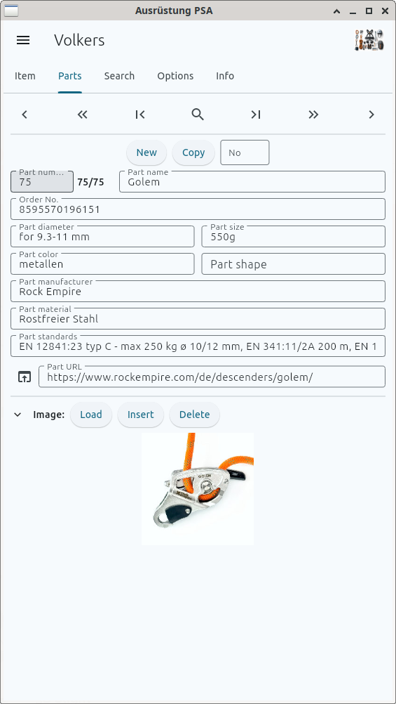
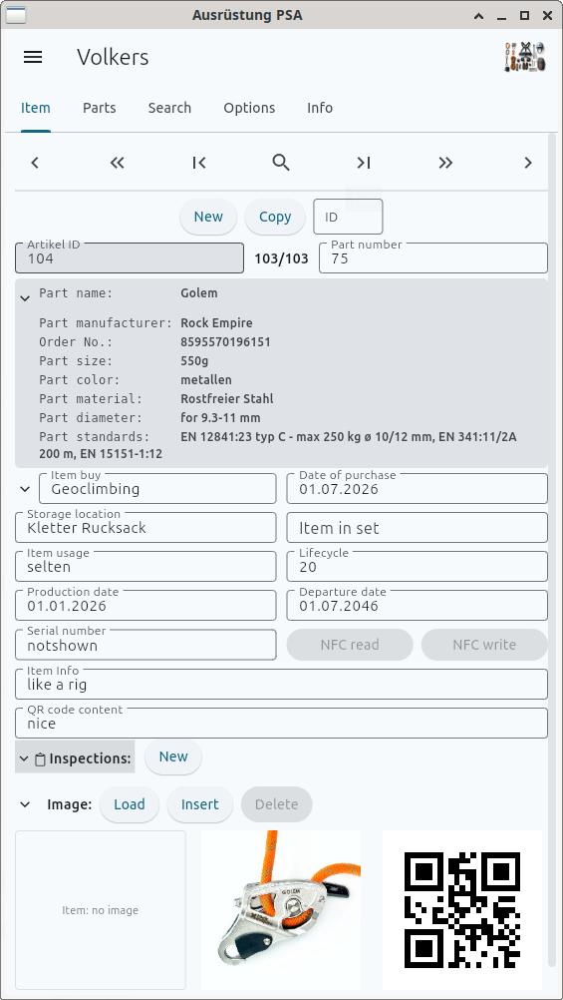
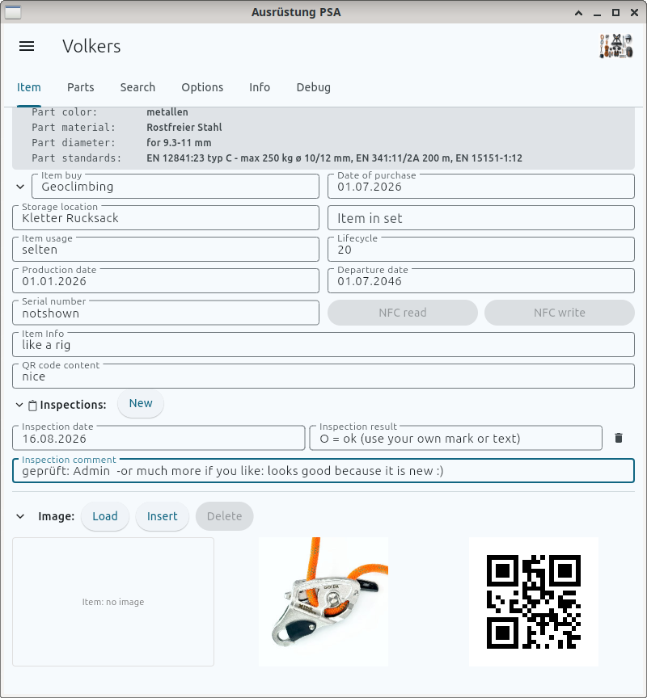
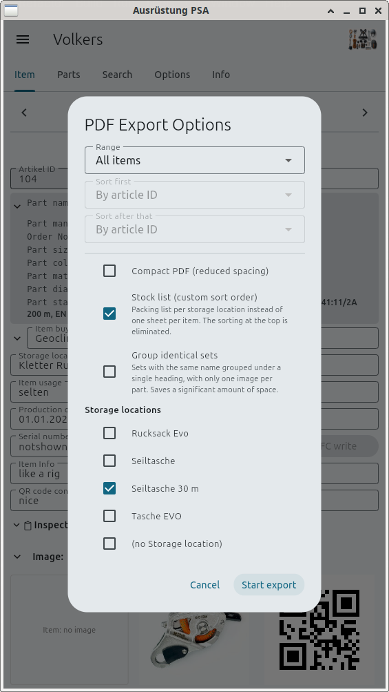
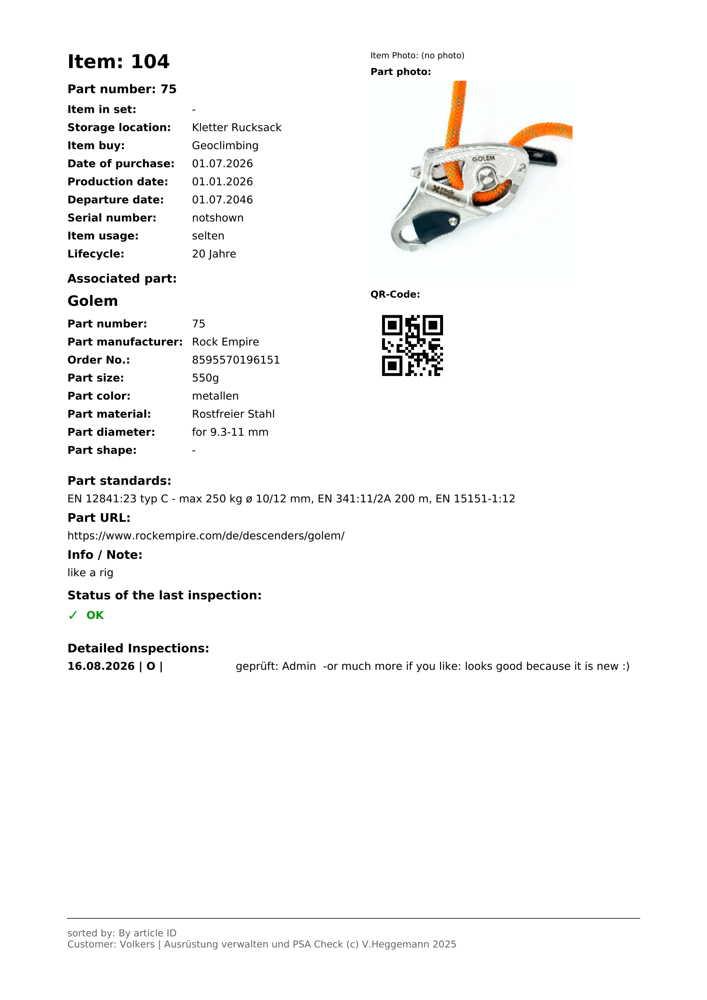
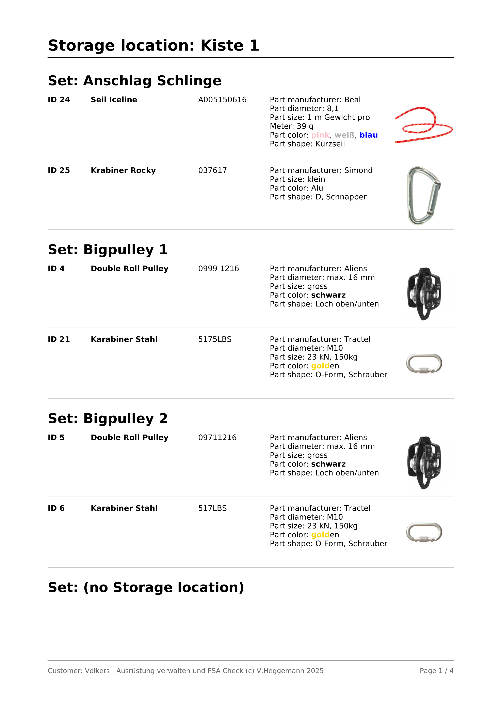

# Ausrüstung — Bedienung

Verwaltung von Kletterausrüstung und PSA-Prüfungen: welches Teil, welcher
Artikel, wann geprüft, wann abzulegen.

## Grundbegriffe

**Teil** ist die Bauart: ein Karabiner eines bestimmten Herstellers mit Name,
Material, Farbe, Norm. Ein Teil beschreibt viele gleiche Stücke.

**Artikel** ist ein einzelnes Stück davon — mit eigener Nummer, eigener
Seriennummer, eigenem Kaufdatum und eigenem Lagerort. Jeder Artikel verweist
auf ein Teil.

**Prüfung** hängt am Artikel. Wird der Artikel gelöscht, gehen seine Prüfungen
mit.

Nummern für Artikel und Teile vergibt das Programm beim Anlegen. Sie lassen
sich nicht ändern.

## Die Reiter

| Reiter | Inhalt |
| --- | --- |
| Artikel | ein Artikel mit seinen Feldern, dem zugehörigen Teil, der aktuellen Prüfung und den Bildern |
| Teile | ein Teil mit seinen Feldern und dem Bild |
| Suche | Suche über Artikel, Teile und Prüfungen |
| Optionen | Benutzer, Sprache, Kunden, Aussehen, Datumsformat, Sichtbarkeiten |
| Info | Plattform, Ablageorte, Datenbestand, Lizenzen |
| Debug | Protokoll (nur wenn in den Optionen eingeschaltet) |

## Erste Schritte

**1.** Im Reiter **Teile** auf *Neu* und die Bauart eintragen: Name,
Hersteller, Best.-Nr., Material, Normen. Die Nummer vergibt das Programm.

**2.** Im Reiter **Artikel** auf *Neu*, in *Teilnummer* die Nummer des eben
angelegten Teils eintragen. Statt der Nummer geht auch der Teilname — das
Programm sucht ihn und trägt die Nummer ein.

**3.** Kaufdatum, Nutzungsdauer, Lagerort und Seriennummer ergänzen. Fertig
sieht ein Artikel so aus: oben die Angaben des Teils, darunter die eigenen
Felder, unten Bilder und QR-Code.

Gespeichert wird, sobald ein Feld verlassen wird. Es gibt keinen
Speichern-Knopf.

## Lagerort und Set

Zwei Felder ordnen die Artikel, und beide sind frei benennbar.

**Lagerort** sagt, wo das Stück liegt: „Kiste 1", aber ebenso „Mitarbeiter A"
oder „OS-XX-123". So lässt sich verwalten, wer welche Ausrüstung bei sich hat
oder was in welchem Fahrzeug liegt.

**Im Set** fasst zusammen, was zusammengehört. Steht bei drei Artikeln
„Expressen Set 1", so bilden sie ein Set — etwa zwei Karabiner und ein
Expressband. Der Name ist frei; die Packliste ordnet danach.

## Ansicht anpassen

Die kleinen Dreiecke am linken Rand klappen Bereiche zu: die Teilangaben, die
weiteren Artikelfelder, die Prüfungen und die Bilder. Zugeklappt bleibt jeweils
die erste Zeile stehen, damit man sieht, worum es geht. Auf dem Telefon lohnt
sich das — was gerade nicht gebraucht wird, verschwindet, und der Rest passt
auf den Schirm.

Der Zustand bleibt erhalten, auch nach dem Beenden.

## Sprache und Aussehen

In den Optionen stehen zwei Auswahlfelder:

**Sprache** listet die vorhandenen Übersetzungen. Steht dort nur „default",
gibt es keine — dann erscheint alles so, wie es im Programm steht.

**Farbschema**: hell, dunkel oder wie das System. Beides gilt je Kunde.

## Blättern

Die Leiste am oberen Rand: an den Anfang, fünf zurück, eines zurück, eines
vor, fünf vor, ans Ende. Das kleine Feld neben *Neu* springt direkt zu einer
Nummer.

Das Lupensymbol in der Mitte schaltet zwischen Suchergebnis und Gesamtbestand
um. Ist es orange hinterlegt, wird gerade das Suchergebnis durchblättert.

## Daten

**Ablegedatum** wird aus Kaufdatum und Nutzungsdauer berechnet. Trägt man es
von Hand ein, bleibt der eingegebene Wert stehen.

**Datumseingabe** versteht mehrere Schreibweisen: `2024-12-31`, `31.12.2024`,
`Dez 2024`, `2024`. Fehlende Teile werden mit dem Monatsanfang ergänzt.
Angezeigt wird im Format, das in den Optionen eingestellt ist.

**Bilder** lassen sich aus einer Datei laden oder aus der Zwischenablage
übernehmen: auf der Herstellerseite die Grafikadresse kopieren, dann in der
App auf *Einfügen*. Artikel und Teil haben jeweils ein eigenes Bild.

**QR-Code** entsteht aus dem Feld *QR-Code Inhalt* und wird bei jeder Anzeige
neu gezeichnet.

## Suche

Suchfeld wählen, Begriff eingeben, *Suchen*. Bei Treffern wechselt die Ansicht
zum Artikel-Reiter.

- `Helm` findet den Text an beliebiger Stelle
- `2024` findet das ganze Jahr 2024
- `>=2024` findet alles ab dem 1. Januar 2024
- `<2024` findet alles davor
- *Alle Felder* durchsucht Artikel, Teile und Prüfungen zugleich
- *Ablegereif* zeigt alle Artikel, deren Ablegedatum überschritten ist

*Suche aufheben* zeigt wieder den ganzen Bestand.

## Prüfungen

Im Artikel-Reiter steht nur die aktuelle Prüfung. *Neu* legt eine mit dem
heutigen Datum an; ist in den Optionen ein Benutzername eingetragen, steht er
in der Bemerkung. Gibt es ältere Prüfungen, führt *Historie* zu ihnen.

## NFC

Die Schaltflächen *NFC read* und *NFC write* stehen neben der Seriennummer.
Sind sie ausgegraut, ist kein NFC verfügbar — der Grund steht im Reiter Info.

Auf dem Handy genügt es, das Gerät an den Tag zu halten; ein Knopfdruck ist
nicht nötig. Auf dem Desktop braucht es einen angeschlossenen USB-Kartenleser.

Was ein Scan bewirkt, hängt vom Cursor ab:

- Cursor im **leeren** Seriennummernfeld: die gelesene Nummer wird eingetragen
- sonst: der Artikel mit dieser Seriennummer wird gesucht und angezeigt

*NFC write* schreibt die angezeigte Seriennummer auf den Tag. Enthält der Tag
fremde Daten, wird nachgefragt. Fabrikneue Tags müssen erst formatiert werden
— das erlaubt der entsprechende Schalter in den Optionen. Formatieren
überschreibt alles, was sonst auf dem Chip steht.

## Kunden

Jeder Kunde hat eigene Daten: eigene Datenbank, eigene Einstellungen. In den
Optionen lässt sich ein Kunde anlegen, wechseln oder löschen. Beim Start
öffnet sich der zuletzt benutzte.

Der letzte verbliebene Kunde wird nicht gelöscht, sondern nur geleert — ohne
Kunde könnte das Programm nichts anzeigen.

## Sichern und Übertragen

Im Menü am linken Rand:

- **Kunde Backup erstellen** packt Einstellungen und Datenbank in eine
  ZIP-Datei.
- **Kunde Backup importieren** liest sie wieder ein und ersetzt dabei den
  Bestand dieses Kunden.
- **Kunden migrieren** überträgt Artikel und Teile von einem Kunden zu einem
  anderen. Bereits vorhandene Datensätze werden übersprungen; übernommene
  bekommen im Ziel neue, fortlaufende Nummern. Prüfungen wandern mit ihrem
  Artikel mit.

Auf dem Desktop wird der Ablageort im Speichern-Dialog gewählt, auf dem Handy
im Teilen-Dialog des Systems (dort steckt „Speichern unter" darin).

## PDF

**PDF exportieren** im Menü fragt nach:

- **Umfang**: der aktuelle Artikel, das Suchergebnis oder alles
- **Sortierung**: zwei Stufen, die zweite greift bei Gleichstand
- **Kompakt**: engere Abstände und kleinere Schrift, spart Seiten
- **Lagerliste**: statt eines Blattes je Artikel eine Packliste je Lagerort;
  dort lassen sich einzelne Orte ankreuzen. Die Sortierung entfällt, die
  Liste ordnet nach Ort, Set und Teil.
- **Gleiche Sets zusammenfassen** (nur bei der Lagerliste): Sets mit gleichem
  Namen kommen unter eine Überschrift, und je Teil erscheint nur ein Bild
  statt eines je Artikel. Das spart erheblich Platz — aus acht Seiten werden
  leicht zwei.

Das Blatt je Artikel enthält alle Angaben, das Bild des Teils, den QR-Code und
die Prüfungen:

Die Packliste ordnet nach Lagerort und Set — der Zettel für die Kiste, das
Fahrzeug oder den Mitarbeiter:

## Wenn etwas klemmt

Optionen → *Debug-Tab anzeigen* einschalten. Der neue Reiter zeigt das
Protokoll und lässt es kopieren oder als Textdatei sichern. Der Filter oben
beschränkt auf Fehler, Warnungen oder Hinweise.

Der Reiter Info nennt die Ablageorte von Einstellungen und Datenbank sowie den
Zustand von NFC.

## Löschen

Die Löschen-Schaltflächen für Artikel und Teile sind zunächst ausgeblendet und
lassen sich in den Optionen einschalten.

Was beim Löschen geschieht: der Datensatz verschwindet aus der Anzeige, bleibt
aber in der Datenbank stehen — nur markiert, ohne Bild, und von den Prüfungen
bleibt die letzte. Der Grund ist die Nummer: würde sie wieder frei, trüge
irgendwann ein anderer Artikel dieselbe Kennung wie auf einem alten Ausdruck.

Nachsehen lässt sich das über **Gelöschte exportieren (CSV)** im Menü — zwei
Dateien, eine für Artikel, eine für Teile. Der Eintrag erscheint nur bei
eingeschaltetem Entwicklermodus.

Das Zurücksetzen der Datenbank in den Optionen löscht dagegen wirklich, ohne
Rückweg.
